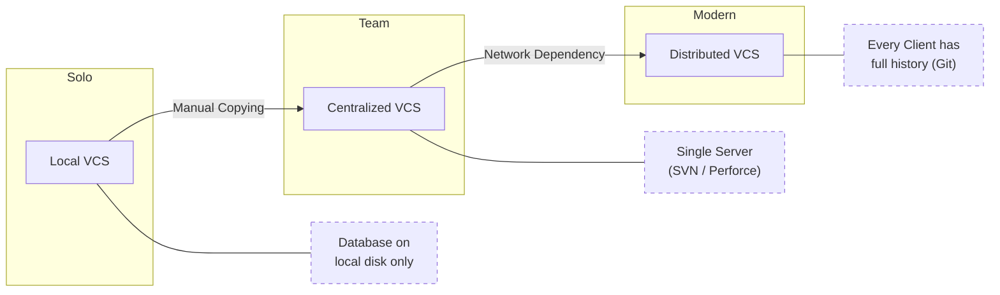
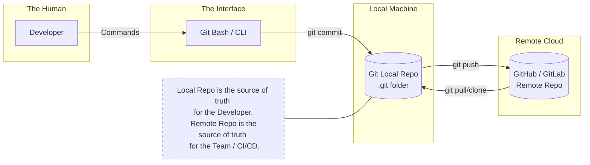
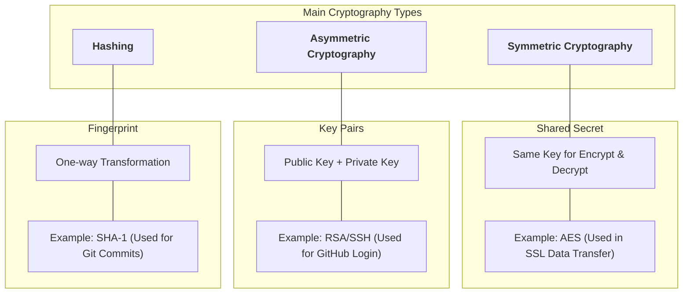
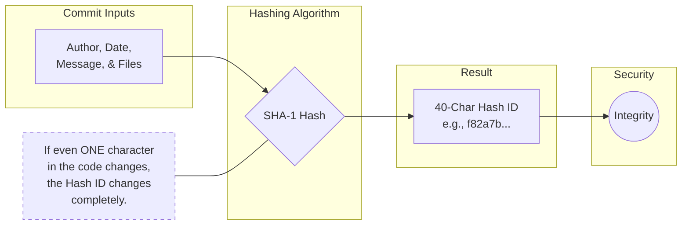
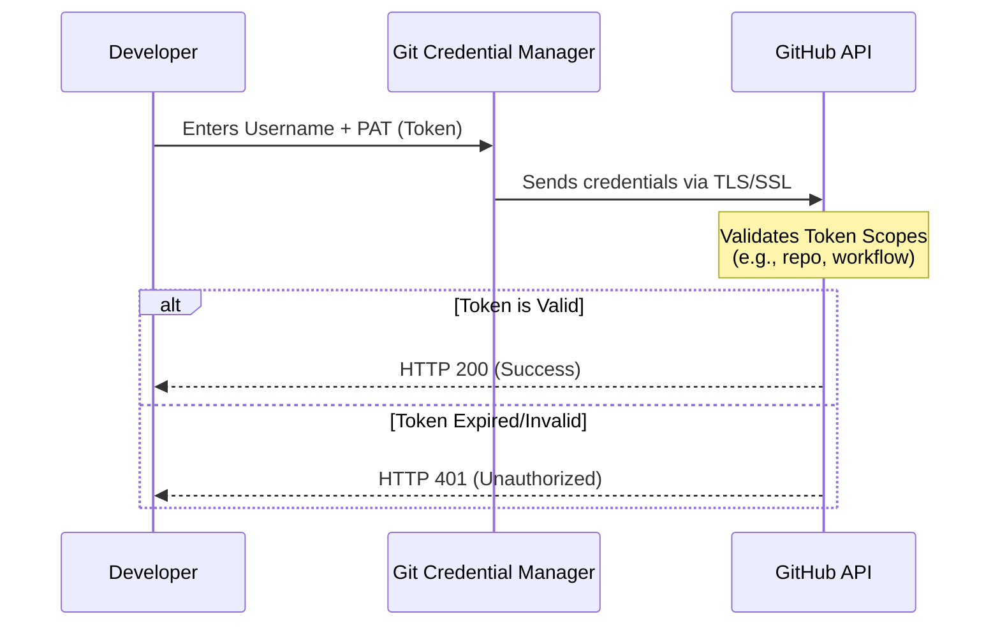
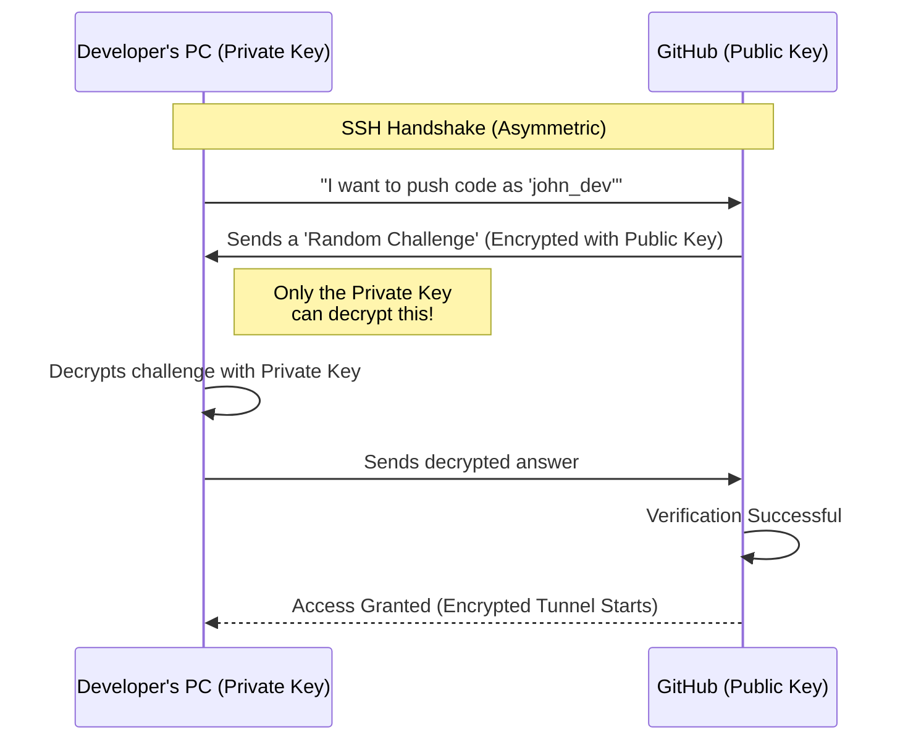
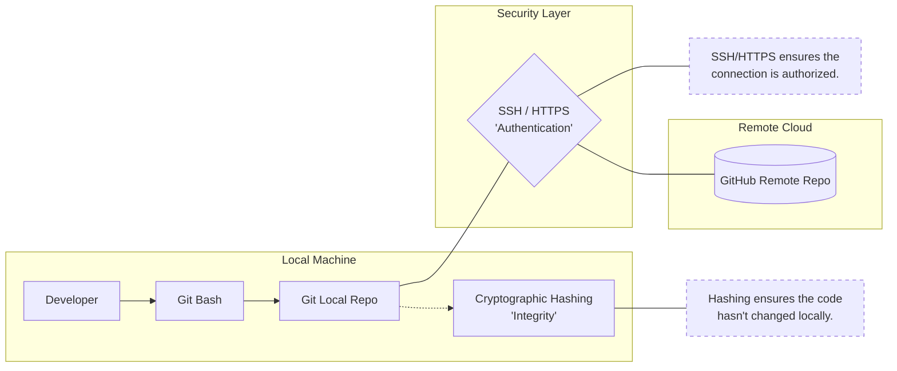

# Git Basics

## 1. What is VCS (Version Control System)?

### Definition

A **Version Control System (VCS)** is a system that tracks changes made to files over time so you can:

* See who changed what
* Go back to previous versions
* Collaborate safely with others

### Why VCS is used

* Prevents accidental data loss
* Enables team collaboration
* Maintains history of changes
* Supports parallel development using branches
* Essential for DevOps, CI/CD, and cloud-native workflows

---

### Types of Version Control Systems

#### 1. Local Version Control System

* Versions stored locally on one machine
* No collaboration support

Example:

* Manual file copies
* RCS (Revision Control System)

Limitations:

* Single point of failure
* No team collaboration

---

#### 2. Centralized Version Control System (CVCS)

* One central server holds the repository
* Clients pull and push changes

Examples:

* SVN
* CVS

Limitations:

* Server failure stops work
* Slower operations
* Requires constant connectivity

---

#### 3. Distributed Version Control System (DVCS)

* Every developer has a full copy of the repository
* Work possible even without network

Examples:

* Git
* Mercurial

Advantages:

* Fast
* Offline work
* Better branching and merging
* Fault tolerant

---

### VCS Evolution Diagram



---

## 2. Git, GitHub, and Git Bash

### What is Git?

* **Git is a distributed version control system**
* Tracks changes in files
* Works locally
* Designed for speed and reliability

Key points:

* Snapshot-based
* Uses cryptographic hashing
* Supports branching and merging efficiently

---

### What is GitHub?

* **GitHub is a remote hosting platform for Git repositories**
* Provides collaboration features:

  * Pull Requests
  * Issues
  * Actions (CI/CD)
  * Code review

GitHub is **not Git**
Git works without GitHub.

---

### What is Git Bash?

* A **terminal emulator** for Windows
* Provides:

  * Linux-like shell
  * Git CLI
  * SSH client

Used mainly on Windows to run Git commands easily.

---

### Relationship Between Git, GitHub, and Git Bash



---

## 3. Cryptography – Foundation of Git & GitHub Security

### What is Cryptography?

Cryptography is the practice of **securing data** using mathematical techniques so that:

* Data cannot be altered
* Identity can be verified
* Communication is secure

---

### Types of Cryptography


#### 1. Hashing

* One-way function
* Same input always gives same output
* Cannot be reversed

Examples:

* SHA-1
* SHA-256

##### How Git uses hashing

* Every commit is identified by a hash
* Any change creates a new hash
* Ensures data integrity

##### Small hands-on

```bash
echo "hello" | sha1sum
```

Change input → hash changes.

---

#### 2. Symmetric Encryption

* Same key used for encryption and decryption
* Fast but key sharing is risky

Example:

* AES

Not directly used in Git authentication.

---

#### 3. Asymmetric Encryption

* Uses a **pair of keys**

  * Public key
  * Private key

Example:

* RSA
* Ed25519

Used in **SSH authentication**.

---

### Cryptography in GitHub



---

## 4. SSH and HTTPS – Communication Methods

### HTTPS Authentication

* Uses username + password OR token
* Encrypted using Transport Layer Security (TLS)
* Simple to set up

Example URL:

```
https://github.com/user/repo.git
```

Authentication methods:

* Personal Access Token (PAT)
* OAuth

Limitations:

* Requires token rotation
* Manual credential management

---

### SSH Authentication

* Uses public/private key cryptography
* Password-less authentication
* More secure and automation-friendly

Example URL:

```
git@github.com:user/repo.git
```

Authentication methods:

* SSH key pair

---

### SSH vs HTTPS Comparison

| Feature       | HTTPS   | SSH       |
| ------------- | ------- | --------- |
| Password-less | No      | Yes       |
| Automation    | Limited | Excellent |
| Security      | Good    | Very High |
| CI/CD usage   | Medium  | Preferred |

---

## 5. Authentication Process for Cloning a Repo

### HTTPS Authentication Flow





---

### SSH Authentication Flow



---

### SSH Hands-on (Minimal)

```bash
ssh-keygen -t ed25519
cat ~/.ssh/id_ed25519.pub
```

Add the public key to GitHub → SSH Keys.

Test:

```bash
ssh -T git@github.com
```

---

## 6. End-to-End Connected View



---

## Key Takeaways (Beginner Mental Model)

* Git tracks **changes**
* GitHub hosts **repositories**
* Git Bash is the **interface**
* Cryptography ensures **integrity + identity**
* SSH is preferred for **secure automation**
* HTTPS is simpler but less flexible
