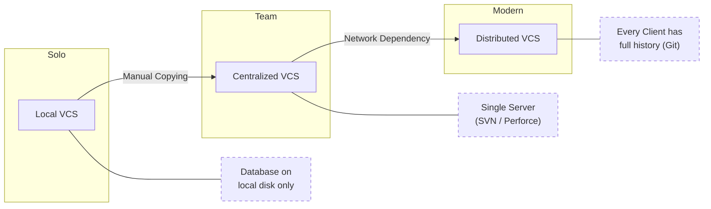
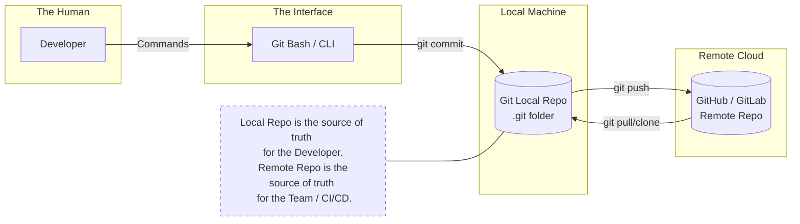

# Git Basics

## 1. What is VCS (Version Control System)?

### Definition

A **Version Control System (VCS)** is a system that tracks changes made to files over time so you can:

* See who changed what
* Go back to previous versions
* Collaborate safely with others

### Why VCS is used

* Prevents accidental data loss
* Enables team collaboration
* Maintains history of changes
* Supports parallel development using branches
* Essential for DevOps, CI/CD, and cloud-native workflows

---

### Types of Version Control Systems

#### 1. Local Version Control System

* Versions stored locally on one machine
* No collaboration support

Example:

* Manual file copies
* RCS (Revision Control System)

Limitations:

* Single point of failure
* No team collaboration

---

#### 2. Centralized Version Control System (CVCS)

* One central server holds the repository
* Clients pull and push changes

Examples:

* SVN
* CVS

Limitations:

* Server failure stops work
* Slower operations
* Requires constant connectivity

---

#### 3. Distributed Version Control System (DVCS)

* Every developer has a full copy of the repository
* Work possible even without network

Examples:

* Git
* Mercurial

Advantages:

* Fast
* Offline work
* Better branching and merging
* Fault tolerant

---

### VCS Evolution Diagram

---

## 2. Git, GitHub, and Git Bash

### What is Git?

* **Git is a distributed version control system**
* Tracks changes in files
* Works locally
* Designed for speed and reliability

Key points:

* Snapshot-based
* Uses cryptographic hashing
* Supports branching and merging efficiently

---

### What is GitHub?

* **GitHub is a remote hosting platform for Git repositories**
* Provides collaboration features:

  * Pull Requests
  * Issues
  * Actions (CI/CD)
  * Code review

GitHub is **not Git**
Git works without GitHub.

---

### What is Git Bash?

* A **terminal emulator** for Windows
* Provides:

  * Linux-like shell
  * Git CLI
  * SSH client

Used mainly on Windows to run Git commands easily.

---

### Relationship Between Git, GitHub, and Git Bash

