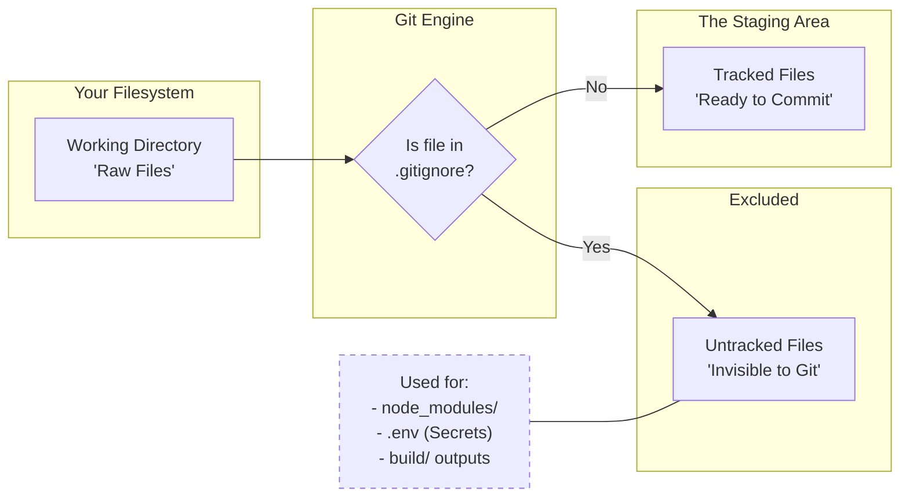
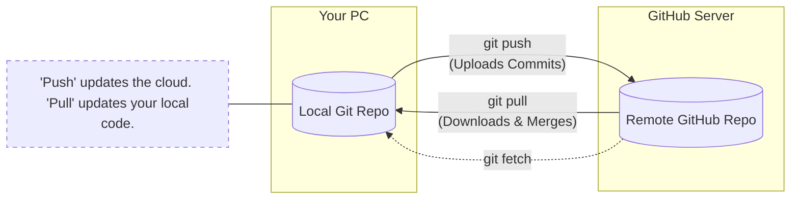
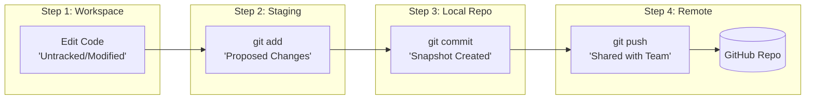
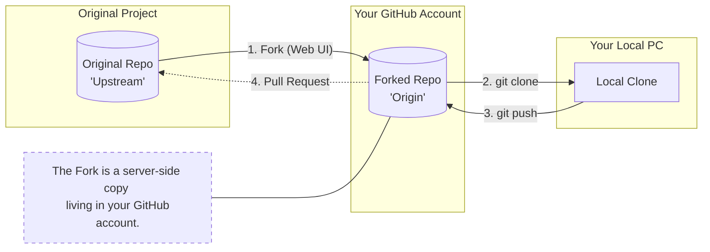
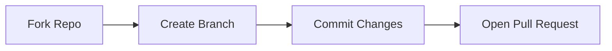
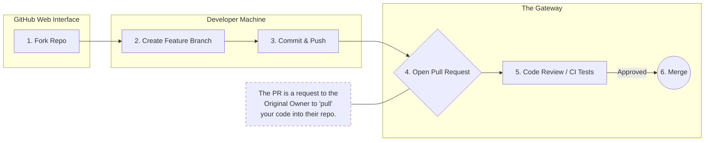
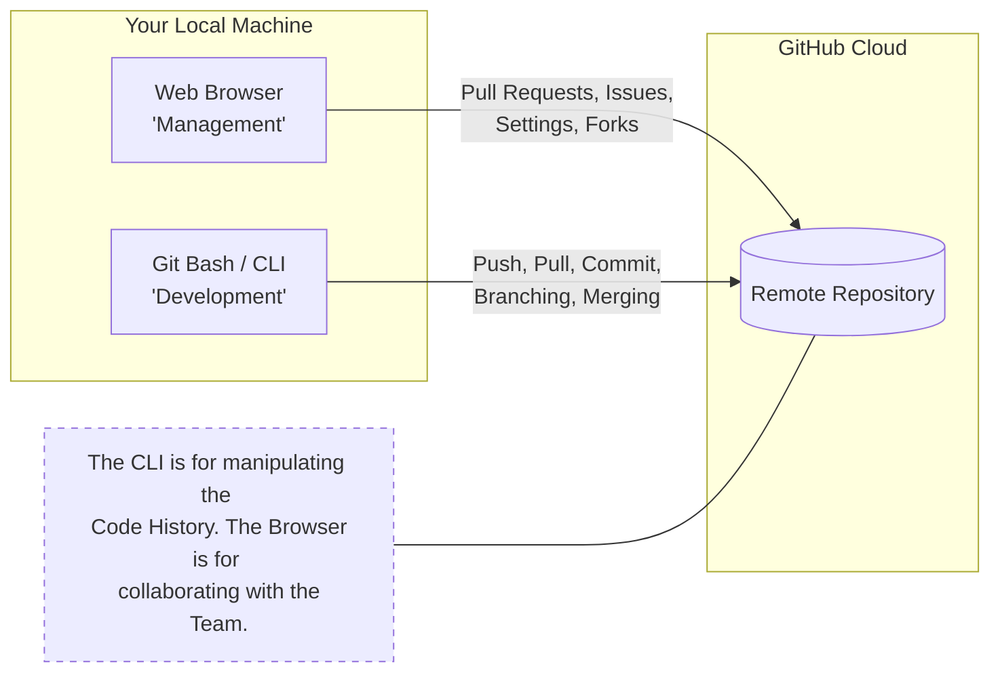
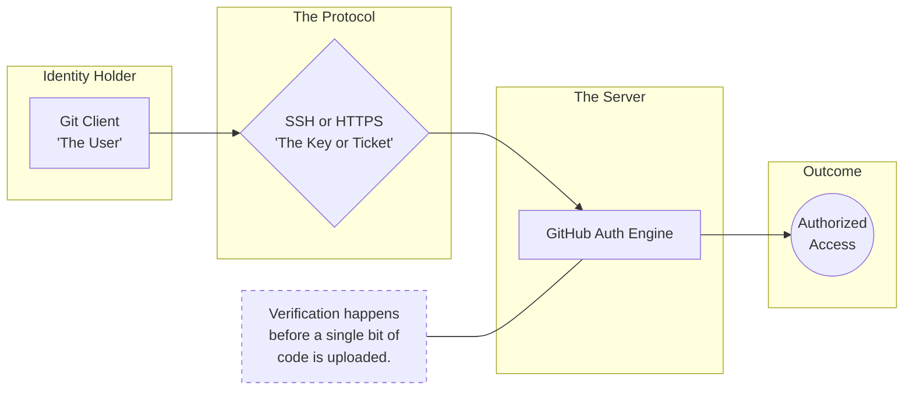

# 02 – GitHub Basics

This section explains how **GitHub works in real projects**, how it connects with local Git, and how developers collaborate safely.

---

## 1. Repository Structure

### What is a Repository?

A **repository (repo)** is a container that holds:

* Source code
* Documentation
* Configuration
* Complete history of changes

A repository can exist:

* Locally (on your machine)
* Remotely (on GitHub)

---

### Default Branch (`main`)

* The **default branch** is the primary branch of a repository
* Modern GitHub repositories use `main` instead of `master`
* This branch usually represents **production-ready code**

---

### Typical Beginner-Friendly Repository Structure

```text
repo/
├── README.md
├── .gitignore
├── src/
├── docs/
```

---

### Key Files Explained

#### `README.md`

* First file users see when opening a repo
* Explains:

  * What the project is
  * How to use it
  * How to contribute

**Why it is mandatory**

* Without README, users don’t understand the project
* GitHub renders it automatically on the repo homepage

---

#### `.gitignore`

* Tells Git **which files NOT to track**
* Prevents committing:

  * Build artifacts
  * Secrets
  * OS-specific files

Example items ignored:

* `node_modules/`
* `.env`
* `.log` files

---

### What Git Tracks vs Ignores



---

## 2. GitHub Account vs Local Git Identity

### Common Beginner Confusion

> “If I set my GitHub username, Git will know who I am”

This is **incorrect**.

---

### Local Git Identity

Git identifies authors using:

```bash
git config --global user.name "Your Name"
git config --global user.email "your@email.com"
```

This information is stored:

* Locally on your machine
* Inside every commit

---

### GitHub Account

* Used for:

  * Login
  * Hosting repositories
  * Permissions
* GitHub matches commits using **email address**

---

### Difference Summary

| Aspect               | Git Identity      | GitHub Account           |
| -------------------- | ----------------- | ------------------------ |
| Scope                | Local machine     | GitHub platform          |
| Purpose              | Commit authorship | Authentication & hosting |
| Required for commits | Yes               | No                       |

---

## 3. Remote Repositories & `origin`

### What is a Remote Repository?

A **remote repository** is:

* A version of your repo stored on another system
* Usually hosted on GitHub

Your local repo can connect to **multiple remotes**.

---

### Why Is It Called `origin`?

* `origin` is **just a default name**
* It represents the **original source** of the repo

You can rename it, but `origin` is a convention.

---

### Key Commands

```bash
git remote -v
git remote add origin <repo-url>
```

---

### Local vs Remote Mental Model



> Local Git and GitHub are **separate systems**

---

## 4. Basic GitHub Workflow (Daily Life Cycle)

### Why This Flow Matters

Git works in **stages**, not in one step.

---

### Standard Workflow



---

### Step Explanation

* `git add`
  Selects changes to include

* `git commit`
  Creates a permanent snapshot

* `git push`
  Sends commits to GitHub

**Why commit before push?**
GitHub only accepts **commits**, not raw file changes.

---

## 5. Fork vs Clone

### Clone

* Creates a local copy of a repository
* Requires **write permission** to push changes

Use clone when:

* You own the repo
* You are a team member

---

### Fork

* Creates a copy **under your GitHub account**
* Used for open-source collaboration

Use fork when:

* You don’t have write access
* You want to contribute safely

---

### Ownership Difference


---
<br>

```bash
# 1. Add the original project as 'upstream'
git remote add upstream https://github.com/ORIGINAL_OWNER/REPO.git

# 2. Pull the latest changes from the original project
git fetch upstream
git merge upstream/main

# 3. Update your own fork on GitHub
git push origin main
```

---

## 6. Pull Requests (PR)

### What is a Pull Request?

A **Pull Request (PR)** is:

* A request to merge changes into another branch
* A review mechanism, not just a merge

---

### Why PRs Exist

* Code review
* Quality checks
* CI pipeline execution
* Team collaboration

---

### PR vs Push

| Action        | Push | Pull Request |
| ------------- | ---- | ------------ |
| Direct change | Yes  | No           |
| Review        | No   | Yes          |
| Used in teams | Rare | Standard     |

---

### Basic PR Flow



---

## 7. Issues & Discussions

### Issues

Used for:

* Bug reports
* Feature requests
* Tasks

Features:

* Labels
* Assignees
* Milestones

---

### Discussions

Used for:

* Questions
* Ideas
* Community interaction

---

### Collaboration Model



---

## 8. GitHub Permissions & Roles

### Basic Roles

| Role  | Access       |
| ----- | ------------ |
| Read  | View only    |
| Write | Push changes |
| Admin | Full control |

---

### Why Permissions Matter

* Prevents unauthorized changes
* Enforces PR-based workflow
* Improves code quality

---

## 9. GitHub Web UI vs CLI

### GitHub Web UI

Can be used for:

* Editing README
* Creating issues
* Reviewing PRs
* Merging PRs

---

### Git CLI (Git Bash)

Required for:

* Writing code
* Running builds
* Creating commits
* Advanced operations

---

### Usage Boundary





---

## 10. GitHub Security Basics

### Why Passwords Are Not Used

* Passwords are insecure for automation
* GitHub removed password authentication for Git

---

### Personal Access Tokens (PAT)

* Acts as a replacement for password
* Used with HTTPS authentication
* Can be scoped and revoked

---

### Why SSH Is Preferred

* Uses key-based authentication
* No password or token entry
* Ideal for CI/CD and automation

---

### Authentication Summary



---

## Final Mental Model

* Git tracks changes
* GitHub hosts collaboration
* PRs control quality
* Forks enable open source
* SSH enables secure automation
