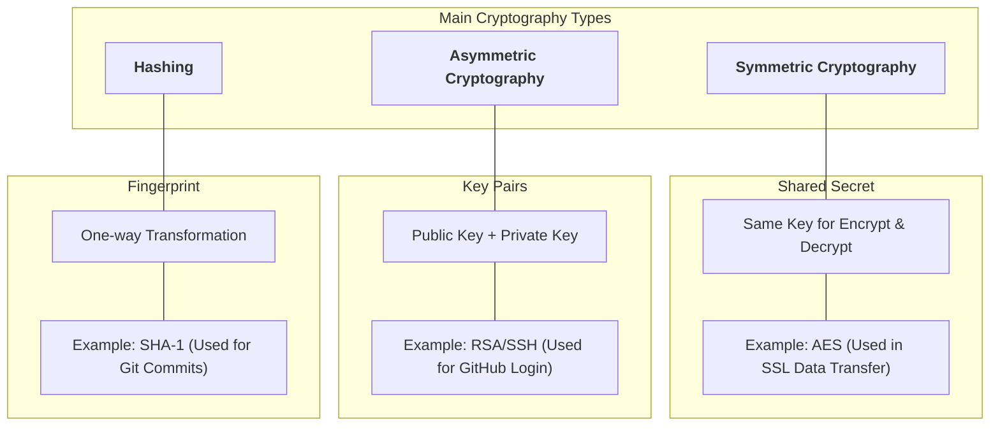
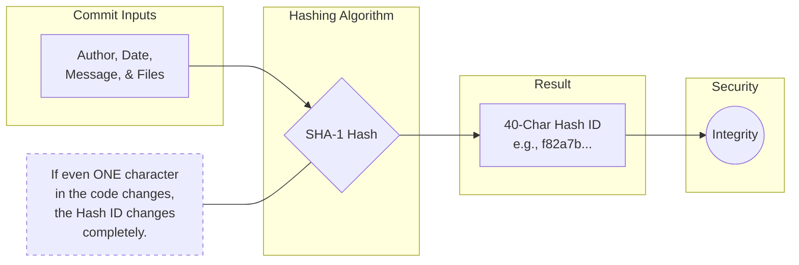
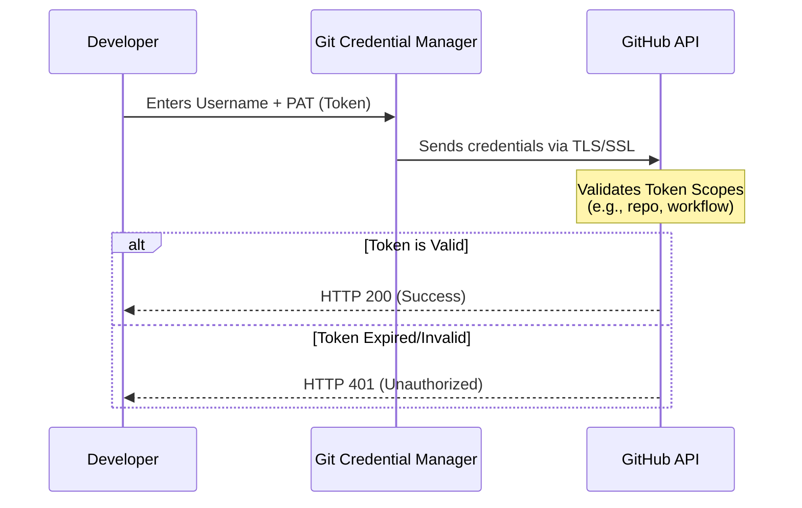
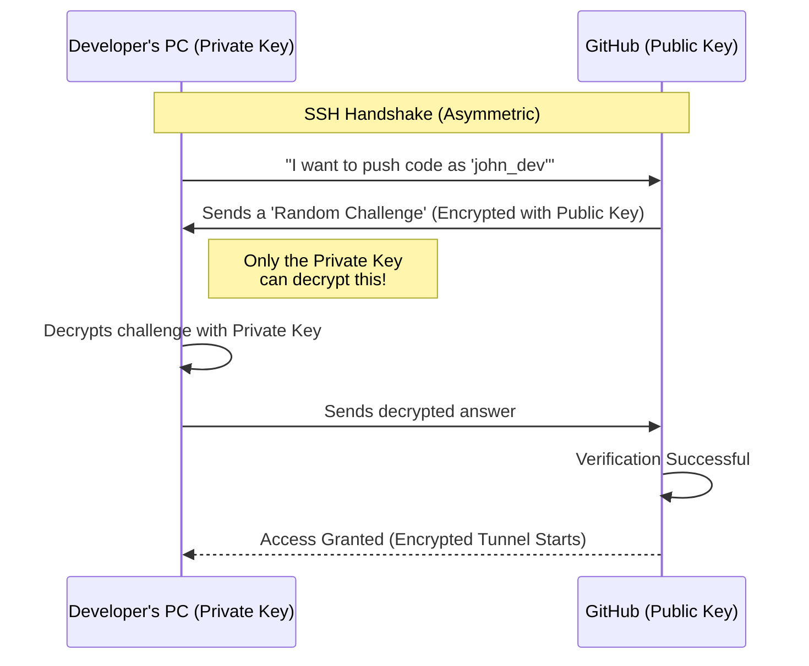
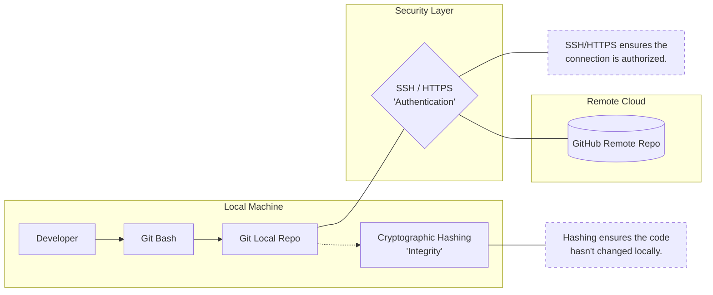

# Cryptography – Foundation of Git & GitHub Security

### What is Cryptography?

Cryptography is the practice of **securing data** using mathematical techniques so that:

* Data cannot be altered
* Identity can be verified
* Communication is secure

---

### Types of Cryptography


#### 1. Hashing

* One-way function
* Same input always gives same output
* Cannot be reversed

Examples:

* SHA-1
* SHA-256

##### How Git uses hashing

* Every commit is identified by a hash
* Any change creates a new hash
* Ensures data integrity

##### Small hands-on

```bash
echo "hello" | sha1sum
```

Change input → hash changes.

---

#### 2. Symmetric Encryption

* Same key used for encryption and decryption
* Fast but key sharing is risky

Example:

* AES

Not directly used in Git authentication.

---

#### 3. Asymmetric Encryption

* Uses a **pair of keys**

  * Public key
  * Private key

Example:

* RSA
* Ed25519

Used in **SSH authentication**.

---

### Cryptography in GitHub



---

## 4. SSH and HTTPS – Communication Methods

### HTTPS Authentication

* Uses username + password OR token
* Encrypted using Transport Layer Security (TLS)
* Simple to set up

Example URL:

```
https://github.com/user/repo.git
```

Authentication methods:

* Personal Access Token (PAT)
* OAuth

Limitations:

* Requires token rotation
* Manual credential management

---

### SSH Authentication

* Uses public/private key cryptography
* Password-less authentication
* More secure and automation-friendly

Example URL:

```
git@github.com:user/repo.git
```

Authentication methods:

* SSH key pair

---

### SSH vs HTTPS Comparison

| Feature       | HTTPS   | SSH       |
| ------------- | ------- | --------- |
| Password-less | No      | Yes       |
| Automation    | Limited | Excellent |
| Security      | Good    | Very High |
| CI/CD usage   | Medium  | Preferred |

---

## 5. Authentication Process for Cloning a Repo

### HTTPS Authentication Flow





---

### SSH Authentication Flow



---

### SSH Hands-on (Minimal)

```bash
ssh-keygen -t ed25519
cat ~/.ssh/id_ed25519.pub
```

Add the public key to GitHub → SSH Keys.

Test:

```bash
ssh -T git@github.com
```

---

## 6. End-to-End Connected View



---

## Key Takeaways (Beginner Mental Model)

* Git tracks **changes**
* GitHub hosts **repositories**
* Git Bash is the **interface**
* Cryptography ensures **integrity + identity**
* SSH is preferred for **secure automation**
* HTTPS is simpler but less flexible


