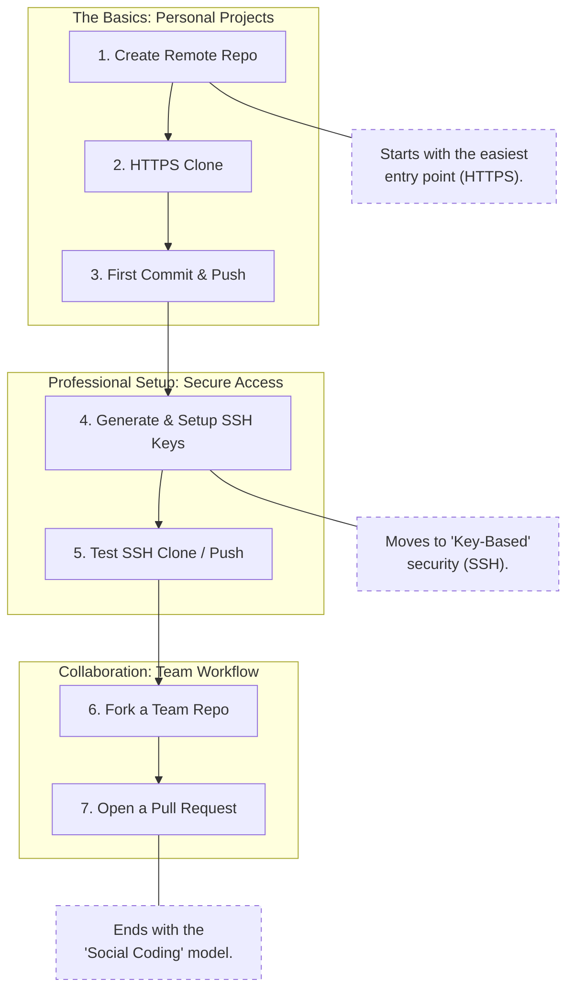
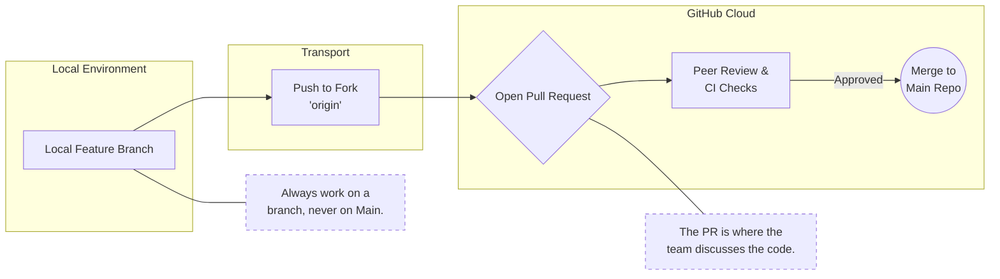

# Hands-On Lab: HTTPS vs SSH – Repo Creation to Pull Request

## Lab Objective

By the end of this lab, you will:

* Create a GitHub repository
* Clone it using **HTTPS**
* Push changes using **PAT**
* Configure **SSH authentication**
* Clone using SSH
* Create a fork
* Raise a **Pull Request**

---

## Lab Prerequisites

* Git installed
* GitHub account
* Git Bash (Windows) or terminal (Linux/Mac)

---

## Scenario Overview

You will simulate:

* **Personal repository (HTTPS)**
* **Open-source contribution (SSH + PR)**



---

## PART 1: HTTPS Authentication Scenario

### Step 1: Create a Repository on GitHub

1. Go to GitHub → New Repository
2. Repository name: `github-auth-lab`
3. Public
4. Initialize with README

---

### Step 2: Clone Repository Using HTTPS

```bash
git clone https://github.com/<your-username>/github-auth-lab.git
cd github-auth-lab
```

---

### Step 3: Make a Change

```bash
echo "HTTPS authentication lab" >> notes.txt
git status
```

---

### Step 4: Commit Changes

```bash
git add notes.txt
git commit -m "Add HTTPS authentication notes"
```

---

### Step 5: Push Using HTTPS (PAT)

```bash
git push origin main
```

Authentication prompt:

* Username: GitHub username
* Password: **Personal Access Token**

---

### Observation

* Password is **not accepted**
* PAT is required
* Credentials may be cached locally

---

## PART 2: SSH Authentication Scenario

### Step 6: Generate SSH Key Pair

```bash
ssh-keygen -t ed25519 -C "your_email@example.com"
```

Press Enter for defaults.

---

### Step 7: Add SSH Key to GitHub

```bash
cat ~/.ssh/id_ed25519.pub
```

* Copy output
* GitHub → Settings → SSH and GPG keys → New SSH key

---

### Step 8: Test SSH Authentication

```bash
ssh -T git@github.com
```

Expected output:

```
Hi <username>! You've successfully authenticated.
```

---

### Step 9: Clone Repository Using SSH

```bash
git clone git@github.com:<your-username>/github-auth-lab.git
cd github-auth-lab
```

---

### Step 10: Push Without Credentials

```bash
echo "SSH authentication lab" >> ssh-notes.txt
git add ssh-notes.txt
git commit -m "Add SSH authentication notes"
git push origin main
```

---

### Observation

* No username/password required
* Authentication happens using SSH keys

---

## PART 3: Fork and Pull Request Scenario

### Step 11: Fork a Repository

1. Open someone else’s repo (or instructor repo)
2. Click **Fork**
3. Fork created under your account

---

### Step 12: Clone Fork Using SSH

```bash
git clone git@github.com:<your-username>/<forked-repo>.git
cd <forked-repo>
```

---

### Step 13: Add Upstream Remote

```bash
git remote add upstream git@github.com:<original-owner>/<repo>.git
git remote -v
```

---

### Step 14: Create Feature Branch

```bash
git checkout -b feature/auth-doc-update
```

---

### Step 15: Make Changes and Commit

```bash
echo "Improved authentication docs" >> README.md
git add README.md
git commit -m "Improve authentication documentation"
```

---

### Step 16: Push Feature Branch

```bash
git push origin feature/auth-doc-update
```

---

### Step 17: Create Pull Request

1. Go to your fork on GitHub
2. Click **Compare & Pull Request**
3. Base repo: Original repo
4. Base branch: `main`
5. Submit PR

---

## Pull Request Flow



---

## Final Observations

| Topic                | HTTPS | SSH     |
| -------------------- | ----- | ------- |
| Auth method          | PAT   | SSH key |
| Passwordless         | No    | Yes     |
| Automation friendly  | No    | Yes     |
| Preferred for DevOps | No    | Yes     |

---

## Common Beginner Mistakes

* Trying to push to original repo without permission
* Using GitHub password instead of PAT
* Forgetting to create a branch before PR
* Not adding `upstream` remote

---

## Lab Completion Checklist

* Repo cloned via HTTPS
* Push done using PAT
* SSH key generated and tested
* Repo cloned via SSH
* Fork created
* Pull Request raised successfully
