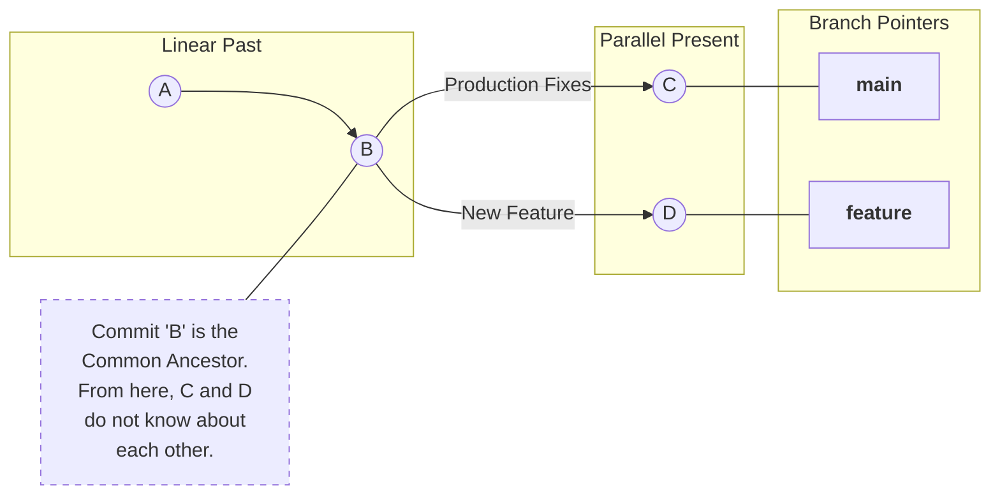
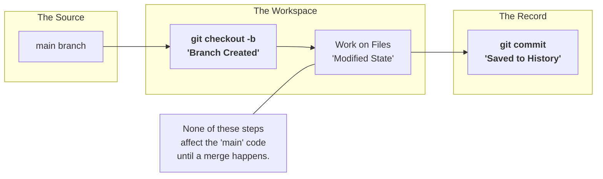
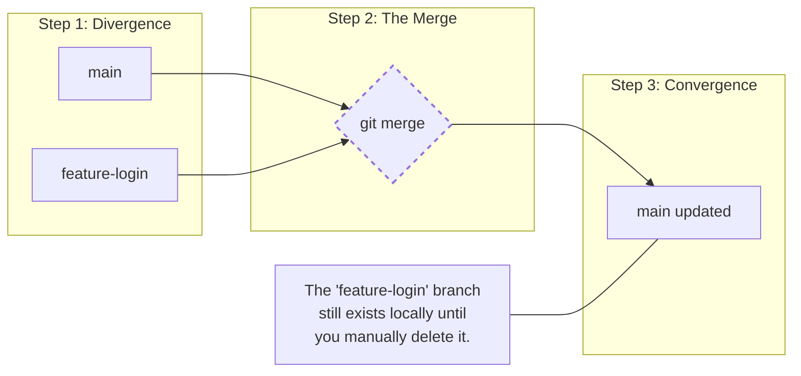
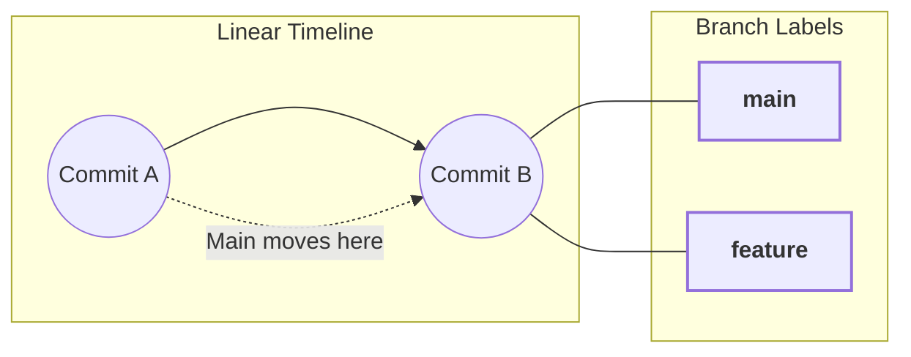
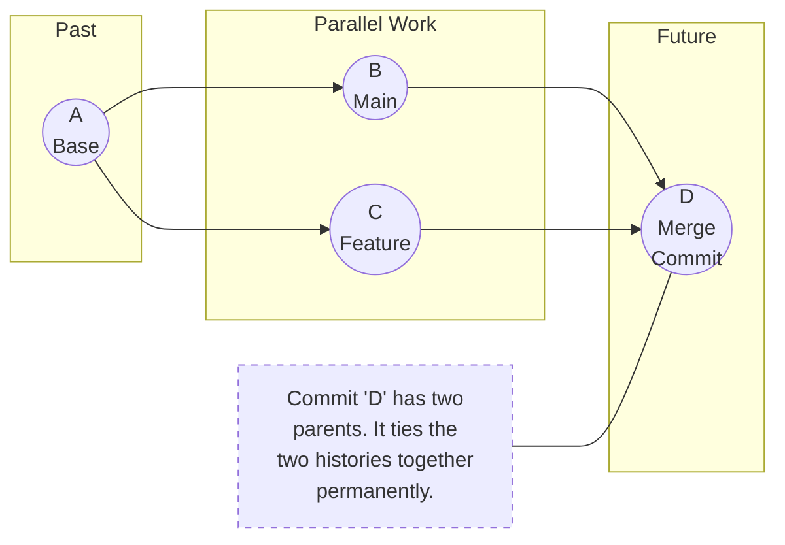
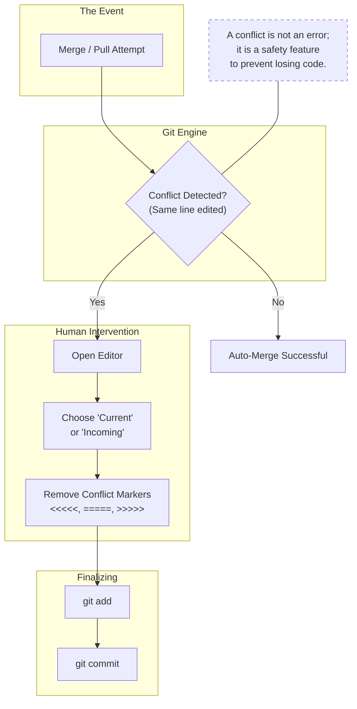
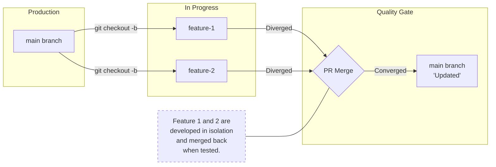
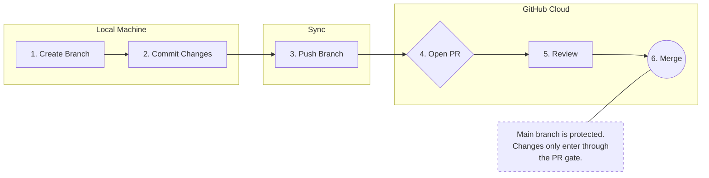

# Git Branching and Merging Strategy

## Objective

This chapter explains:

* Why branches exist
* How branching works internally
* Common branching strategies
* How merging works
* Hands-on commands with real workflow
* How teams use branches in real projects

---

## 1. What is a Branch in Git?

### Definition

A **branch** in Git is a **movable pointer** to a commit.

* Branches allow parallel development
* Changes in one branch do not affect others
* Default branch is usually `main`

---

### Why Branching is Needed

Without branches:

* Everyone works on the same code
* High risk of breaking production
* No isolation for features or fixes

With branches:

* Safe experimentation
* Parallel work
* Controlled releases

---

### Branch Concept



---

## 2. Types of Branches (Beginner to Team Level)

### 1. Main / Master Branch

* Represents stable, production-ready code
* Should always be deployable
* Direct commits are usually restricted

---

### 2. Feature Branch

* Used to develop a new feature
* Created from `main`
* Merged back after completion

Naming examples:

* `feature/login`
* `feature/payment-api`

---

### 3. Bugfix / Hotfix Branch

* Used to fix issues
* Hotfix is used for production issues

Examples:

* `bugfix/ui-alignment`
* `hotfix/security-patch`

---

## 3. Basic Branching Commands (Hands-On)

### Create a New Branch

```bash
git branch feature-login
```

---

### Switch to a Branch

```bash
git checkout feature-login
```

OR (modern command):

```bash
git switch feature-login
```

---

### Create and Switch in One Command

```bash
git checkout -b feature-login
```

---

### List Branches

```bash
git branch
```

---

### Delete a Branch (After Merge)

```bash
git branch -d feature-login
```

---

## 4. Hands-On Scenario: Feature Development

### Scenario

You want to add a **login feature** without breaking `main`.

---

### Step 1: Ensure You Are on Main

```bash
git checkout main
git pull origin main
```

---

### Step 2: Create Feature Branch

```bash
git checkout -b feature-login
```

---

### Step 3: Make Changes

```bash
echo "Login feature code" >> login.txt
git status
```

---

### Step 4: Commit Changes

```bash
git add login.txt
git commit -m "Add login feature"
```

---

### Action Flow (Feature Branch)



---

## 5. Merging Branches

### What is Merge?

Merging combines changes from one branch into another.

Most common merge:

* Feature branch → Main branch

---

### Step 5: Switch Back to Main

```bash
git checkout main
```

---

### Step 6: Merge Feature Branch

```bash
git merge feature-login
```

---

### Resulting Flow



---

## 6. Merge Types (Concept Level)

### 1. Fast-Forward Merge

Occurs when:

* Main has no new commits
* Feature branch is directly ahead



---

### 2. Three-Way Merge

Occurs when:

* Both branches have new commits



---

## 7. Merge Conflicts

### What is a Merge Conflict?

Occurs when:

* Same file
* Same line
* Modified differently in both branches

---

### Conflict Example

```bash
git merge feature-login
```

Git output:

```
CONFLICT (content): Merge conflict in app.txt
```

---

### Resolving Conflict

1. Open conflicted file
2. Choose correct changes
3. Remove conflict markers
4. Commit resolution

```bash
git add app.txt
git commit -m "Resolve merge conflict"
```

---

### Conflict Resolution Flow



---

## 8. Branching Strategies (Real-World)

### 1. Feature Branch Strategy (Most Common)

* One branch per feature
* Merged via Pull Request



Used by:

* Small teams
* Open-source projects

---

### 2. GitHub Flow (Beginner-Friendly)

Steps:

1. Create branch from `main`
2. Commit changes
3. Open Pull Request
4. Review
5. Merge to `main`

No release branches.

---

### 3. GitFlow 

Branches:

```yaml
main        # Production-ready, stable code
develop     # Integration branch for ongoing development
feature/*   # New feature development branches
release/*   # Pre-release testing and stabilization
hotfix/*    # Urgent fixes for production issues
```

Used in:

* Large teams
* Release-based products

---

## 9. Branching + Pull Request Workflow



---

## 10. Best Practices for Beginners

* Always create a branch for work
* Keep branches small and focused
* Pull latest changes before merging
* Delete branches after merge
* Never commit directly to `main`

---

## Common Beginner Mistakes

* Working directly on `main`
* Forgetting to switch branches
* Merging without pulling latest changes
* Ignoring merge conflicts

---

## Final Mental Model

* Branch = isolated workspace
* Commit = checkpoint
* Merge = combine work
* PR = controlled merge
