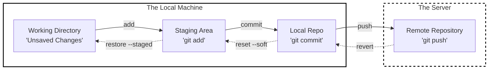
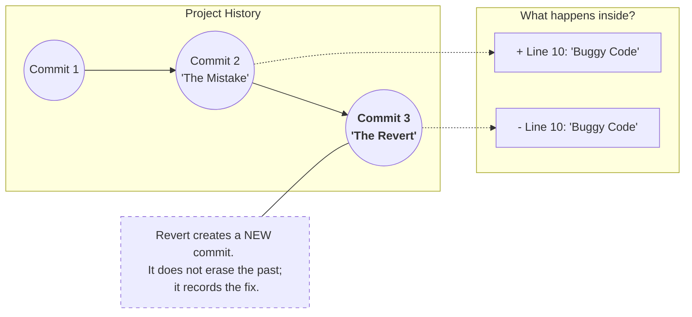
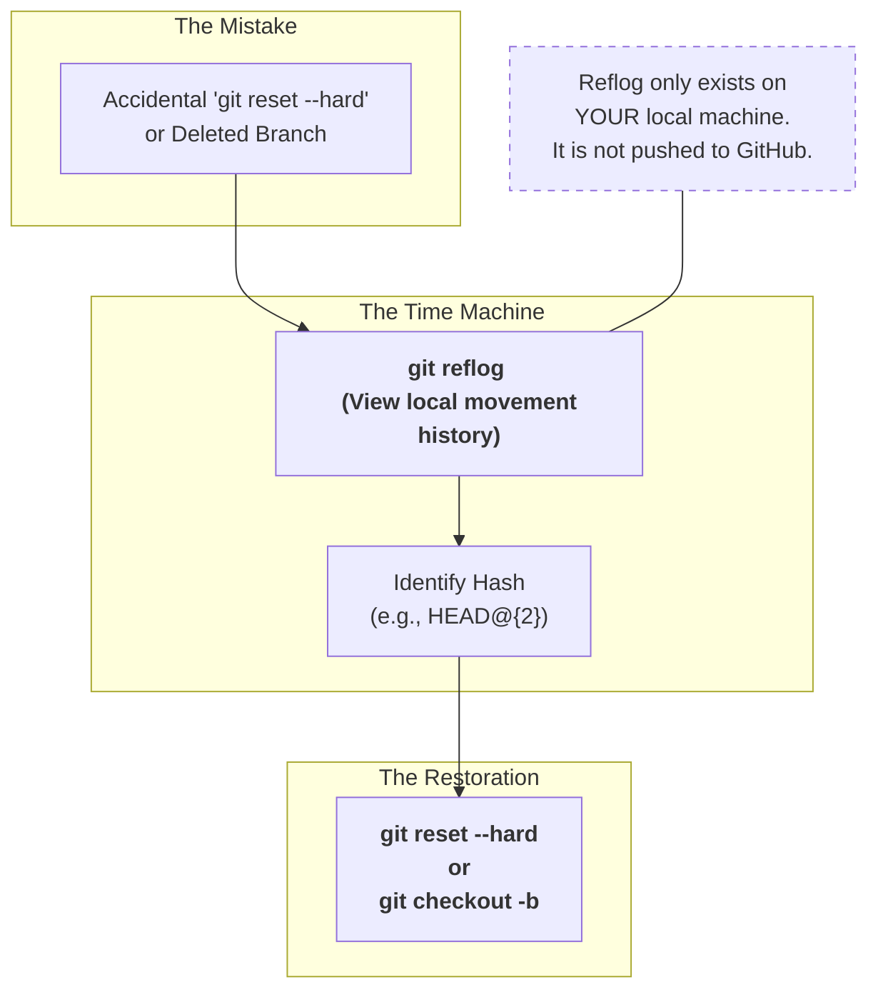

# Git Undo and Recovery – Concepts & Hands-On

## Objective

This chapter covers how to **safely undo mistakes** in Git at different stages:

* Before commit
* After commit
* After push
* In shared repositories (GitHub)

---

## 1. Mental Model: Where Can Mistakes Happen?

Git has **three main areas** where undo actions differ.



Undo commands depend on **which stage the mistake is in**.

---

## 2. Undo Changes in Working Directory (Not Staged)

### Scenario

* You modified a file
* You want to discard the change completely

### Command

```bash
git checkout -- file.txt
```

OR (modern):

```bash
git restore file.txt
```

### Effect

* Reverts file to last committed state
* Changes are **lost permanently**

---

## 3. Undo Staged Changes (Before Commit)

### Scenario

* You ran `git add`
* You want to unstage files but keep changes

### Command

```bash
git restore --staged file.txt
```

### Effect

* File moves back to working directory
* Content is preserved

---

## 4. Undo Last Commit (Not Pushed)

### Scenario

* Commit message is wrong
* Small change missed
* Commit not pushed yet

### Soft Reset (Keep Changes)

```bash
git reset --soft HEAD~1
```

* Removes commit
* Keeps changes staged

---

### Mixed Reset (Default)

```bash
git reset HEAD~1
```

* Removes commit
* Keeps changes unstaged

---

### Hard Reset (Dangerous)

```bash
git reset --hard HEAD~1
```

* Deletes commit
* Deletes changes permanently

---

## 5. Amend Last Commit

### Scenario

* Need to update last commit
* Fix typo or add file

```bash
git commit --amend
```

* Modifies last commit
* Changes commit hash

Use only if **not pushed**.

---

## 6. Undo Changes After Push (Safe Way)

### Important Rule

> **Never rewrite history on shared branches**

---

### Revert Commit (Recommended)

```bash
git revert <commit-hash>
```

* Creates a new commit
* Safely undoes previous commit
* Safe for `main` branch

---

### Revert Flow



---

## 7. Reset vs Revert (Interview Favorite)

| Feature                  | reset | revert |
| ------------------------ | ----- | ------ |
| History rewritten        | Yes   | No     |
| Safe for shared branches | No    | Yes    |
| Deletes commits          | Yes   | No     |
| Creates new commit       | No    | Yes    |

---

## 8. Recover Deleted Commits (git reflog)

### Scenario

* Accidentally ran `git reset --hard`
* Lost commits

### Command

```bash
git reflog
```

Shows:

* Every HEAD movement
* Even deleted commits

---

### Recover Using Reflog

```bash
git reset --hard <reflog-hash>
```

---

### Recovery Flow



---

## 9. Undo File Deletion

### Scenario

* File deleted accidentally

```bash
git restore file.txt
```

OR (older):

```bash
git checkout -- file.txt
```

---

## 10. Undo Push (Advanced Warning)

### Scenario

* Pushed wrong commit to personal branch

```bash
git reset --hard HEAD~1
git push origin branch-name --force
```

Use only:

* On personal branches
* Never on shared branches

---

## 11. Common Beginner Mistakes

* Using `reset --hard` blindly
* Force-pushing to `main`
* Undoing without checking `git status`
* Not using `revert` for pushed commits

---

## 12. Quick Decision Table

| Situation           | Command                |
| ------------------- | ---------------------- |
| Undo local change   | `git restore`          |
| Unstage file        | `git restore --staged` |
| Fix last commit     | `git commit --amend`   |
| Undo pushed commit  | `git revert`           |
| Recover lost commit | `git reflog`           |

---

## Final Mental Model

* **Working directory** → use `restore`
* **Staging area** → use `restore --staged`
* **Local commits** → use `reset`
* **Pushed commits** → use `revert`
* **Lost commits** → use `reflog`

---
