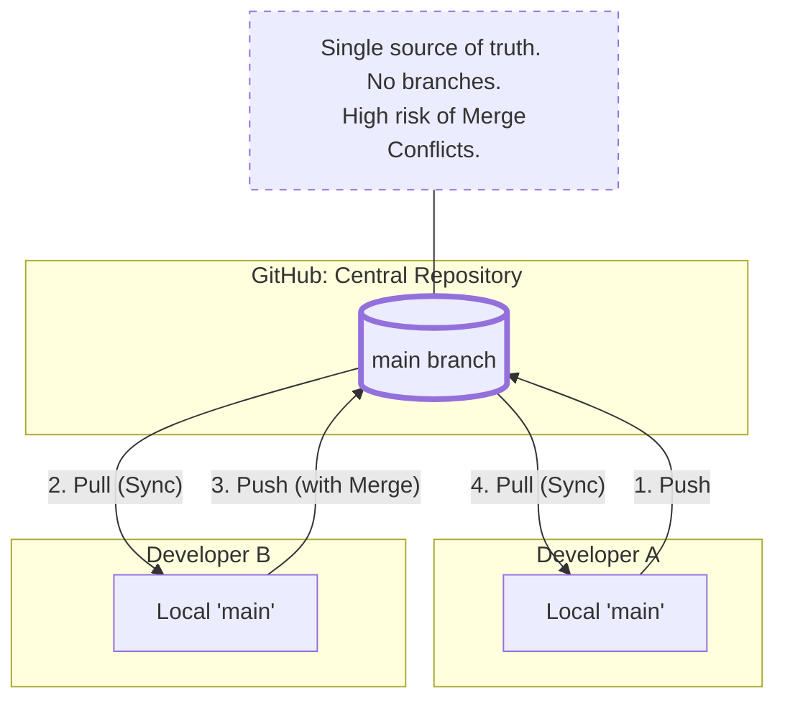
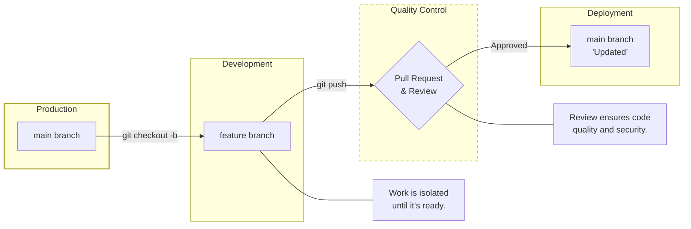
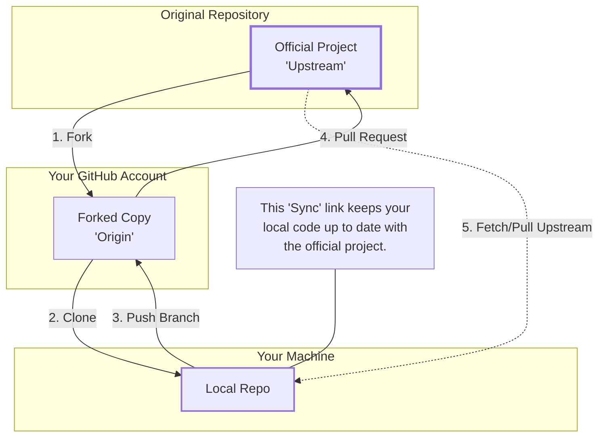
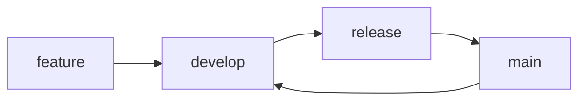
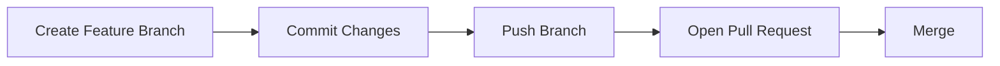
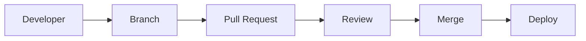

# GitHub Workflows

## 1. Definition – What is a GitHub Workflow?

A **GitHub Workflow** is a **defined process** that describes **how code changes move** from:

* Local development
* To collaboration
* To review
* To merge
* To release

A workflow answers:

* *Who works on what?*
* *In which order?*
* *With what rules?*

> A workflow is **not a tool** — it is a **process** implemented using Git, GitHub features, and team rules.

---

## 2. Why GitHub Workflows Are Needed (Functions)

GitHub workflows are used to:

1. Enable **collaboration** among developers
2. Prevent **direct changes to production code**
3. Enforce **code review**
4. Maintain **code quality**
5. Enable **parallel development**
6. Support **CI/CD automation**
7. Track **who changed what and why**

---

## 3. Core Components Used in GitHub Workflows

GitHub workflows are built using these GitHub features:

* Branches
* Pull Requests
* Reviews
* Issues
* Permissions
* GitHub Actions (automation)

---

## 4. Types of GitHub Workflows (Beginner → Industry)

### 1. Centralized Workflow

#### Description

* Single main branch
* Everyone pushes directly to `main`

#### Usage

* Very small teams
* Learning environments

#### Flow



#### Limitation

* No isolation
* High risk of breaking production

---

### 2. Feature Branch Workflow (Most Common)

#### Description

* Each feature is developed in a separate branch
* Merged via Pull Request

#### Flow



#### Usage

* Startups
* Open-source projects
* Most DevOps teams

---

### 3. Forking Workflow (Open Source)

#### Description

* Contributors fork the repository
* Changes are proposed via Pull Requests

#### Flow



#### Usage

* Open-source projects
* External contributors

---

### 4. GitFlow Workflow (Structured Release Model)

#### Description

* Uses multiple long-lived branches
* Designed for release-based products

#### Core Branches

```text
main
develop
feature/*
release/*
hotfix/*
```

#### Flow



---

## 5. GitHub Commands Used in Workflows

### Branch Management

```bash
git branch
git checkout -b feature-login
git switch main
```

---

### Syncing with Remote

```bash
git pull origin main
git push origin feature-login
```

---

### Remote Management

```bash
git remote -v
git remote add upstream <url>
```

---

### Pull Request Support Commands

```bash
git fetch
git merge
git rebase
```

---

## 6. Hands-On Lab 1: Feature Branch Workflow

### Objective

Simulate a real team workflow using feature branches and PRs.

---

### Step 1: Clone Repository

```bash
git clone git@github.com:<your-username>/workflow-lab.git
cd workflow-lab
```

---

### Step 2: Create Feature Branch

```bash
git checkout -b feature-readme-update
```

---

### Step 3: Make Changes

```bash
echo "Workflow update" >> README.md
```

---

### Step 4: Commit Changes

```bash
git add README.md
git commit -m "Update README using feature branch"
```

---

### Step 5: Push Branch

```bash
git push origin feature-readme-update
```

---

### Step 6: Open Pull Request

* Go to GitHub
* Click **Compare & Pull Request**
* Base: `main`
* Submit PR

---

### Step 7: Merge Pull Request

* Review changes
* Merge using GitHub UI

---

### Workflow Action Flow



---

## 7. Hands-On Lab 2: Forking Workflow

### Objective

Simulate open-source contribution.

---

### Step 1: Fork Repository (GitHub UI)

* Fork instructor repo
* Clone fork locally

```bash
git clone git@github.com:<your-username>/workflow-lab.git
```

---

### Step 2: Add Upstream

```bash
git remote add upstream git@github.com:<original-owner>/workflow-lab.git
```

---

### Step 3: Create Branch

```bash
git checkout -b feature-doc-fix
```

---

### Step 4: Commit and Push

```bash
git add .
git commit -m "Fix documentation"
git push origin feature-doc-fix
```

---

### Step 5: Create Pull Request

* Base: original repo `main`
* Head: forked repo branch

---

## 8. Hands-On Lab 3: GitFlow (Conceptual Practice)

### Scenario

Release version `v1.0.0`

```bash
git checkout develop
git checkout -b release/v1.0.0
```

Fix issues → commit → merge to `main` and `develop`.

---

## 9. Common Beginner Mistakes

* Working directly on `main`
* Skipping Pull Requests
* Not pulling latest changes
* Forgetting to delete merged branches

---

## 10. Interview-Ready Summary

* Workflow = process
* Branches isolate work
* PRs enforce quality
* Forks enable open source
* GitHub Actions automate workflows

---

## Final Mental Model


