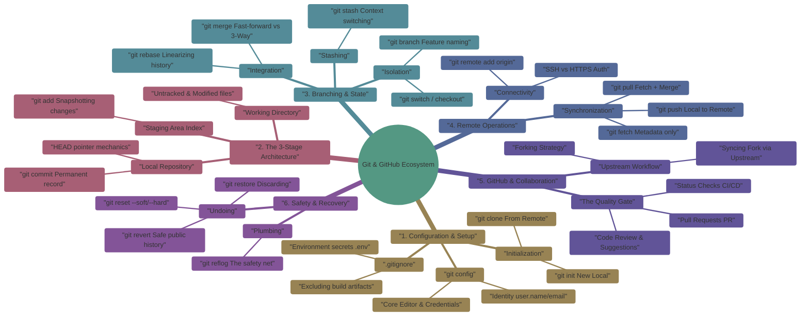

```mermaid
%%{init: {'theme': 'base', 'themeVariables': { 'primaryColor': '#a1cbbeff', 'primaryTextColor': '#333', 'primaryBorderColor': '#333', 'lineColor': '#aba0a0ff' }}}%%
mindmap
  root(("Git & GitHub Ecosystem"))
    "1. Configuration & Setup"
      "git config"
        "Identity user.name/email"
        "Core Editor & Credentials"
      "Initialization"
        "git init New Local"
        "git clone From Remote"
      ".gitignore"
        "Excluding build artifacts"
        "Environment secrets .env"

    "2. The 3-Stage Architecture"
      "Working Directory"
        "Untracked & Modified files"
      "Staging Area Index"
        "git add Snapshotting changes"
      "Local Repository"
        "git commit Permanent record"
        "HEAD pointer mechanics"

    "3. Branching & State"
      "Isolation"
        "git branch Feature naming"
        "git switch / checkout"
      "Integration"
        "git merge Fast-forward vs 3-Way"
        "git rebase Linearizing history"
      "Stashing"
        "git stash Context switching"

    "4. Remote Operations"
      "Connectivity"
        "git remote add origin"
        "SSH vs HTTPS Auth"
      "Synchronization"
        "git push Local to Remote"
        "git fetch Metadata only"
        "git pull Fetch + Merge"

    "5. GitHub & Collaboration"
      "The Quality Gate"
        "Pull Requests PR"
        "Code Review & Suggestions"
        "Status Checks CI/CD"
      "Upstream Workflow"
        "Forking Strategy"
        "Syncing Fork via Upstream"

    "6. Safety & Recovery"
      "Undoing"
        "git restore Discarding"
        "git reset --soft/--hard"
        "git revert Safe public history"
      "Plumbing"
        "git reflog The safety net"
```
