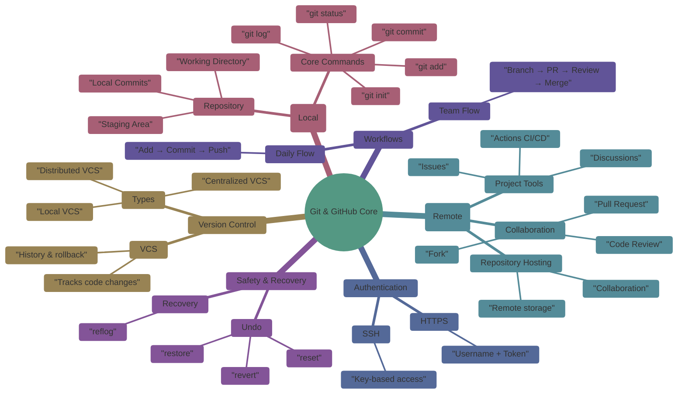

<div align="center">


# Git & GitHub
### Version Control and Collaborative Development

[](https://opensource.org/licenses/MIT)
[](https://git-scm.com/)
[](http://makeapullrequest.com)

---

**Learn how modern software teams build, track, and collaborate on code using Git and GitHub.**

[Explore Labs](#-getting-started) • [View Modules](#-what-you-will-learn) • [Contribute](#-collaboration)

</div>


<br/>

---

## Overview of Git & GitHub



---

## Why This Repo?

Git and GitHub are **foundational skills** for every software engineer, DevOps engineer, and SRE.
This repository is designed to take a **complete beginner** and build a **strong, practical understanding** of:

* How Git works internally
* How GitHub enables collaboration
* How real teams use branches, pull requests, and reviews
* How to recover safely from mistakes

This repo focuses on **hands-on learning**, not command memorization.

---

## What You Will Learn

* **Version Control Basics**: VCS concepts, Git vs other systems
* **Git Internals**: Working directory, staging, commits, history
* **GitHub Fundamentals**: Repositories, README, `.gitignore`, licenses
* **Branching & Merging**: Feature branches, release flow, hotfixes
* **Collaboration**: Forks, pull requests, reviews, issues
* **Authentication**: HTTPS vs SSH, tokens, key-based access
* **Undo & Recovery**: reset, revert, reflog, safe recovery patterns
* **GitHub Workflows**: Beginner-friendly CI/CD introduction

By the end, learners can confidently work on **real-world GitHub projects**.

---

## Collaboration

This repository encourages **real open-source practices**.

You can contribute by:

* Improving explanations
* Adding labs or diagrams
* Fixing documentation gaps
* Proposing better workflows

> Collaboration here mirrors **real GitHub team environments**.

---

## Getting Started

1. Clone the repository:

```bash
git clone https://github.com/arira-ai/ar_git_github.git
cd ar_git_github
```

2. Follow folders in numeric order
3. Practice every lab locally using Git Bash or terminal

---

## Note

* All commands are tested on Linux, macOS, and Git Bash (Windows)
* Follow the folder order to build concepts **incrementally**
* This repo is safe for **self-learning, classroom training, and interviews**

---

### Instructor Note

This GitHub module pairs naturally with:

* Linux fundamentals
* Docker
* Kubernetes
* CI/CD pipelines

It is designed to **grow with the learner**, from basics to production workflows.

---
