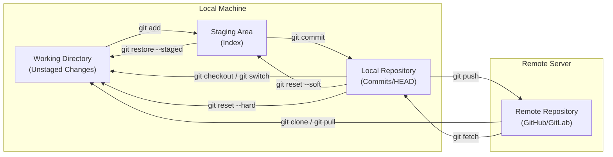
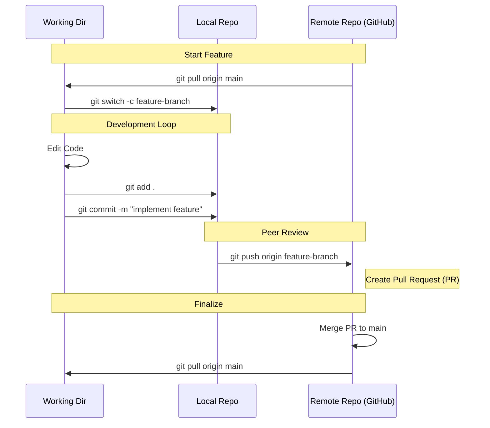

To represent the Git lifecycle effectively, it is best to visualize it as a movement of data across four distinct areas: the **Working Directory**, the **Staging Area**, the **Local Repository**, and the **Remote Repository**.

Below is a comprehensive flow structure using Mermaid syntax, followed by a categorized command list for professional workflows.

### 1. The Core Git Data Flow
This diagram tracks how code moves from a local change to a remote server.

---

### 2. Comprehensive Command Reference

#### **A. Project Initialization**
| Command | Action |
| :--- | :--- |
| `git init` | Initialize a new local repository. |
| `git clone <url>` | Copy a remote repository to your local machine. |
| `git config --global user.name "Name"` | Set your identifier for commits. |

#### **B. The Daily Workflow (Capture Changes)**
| Command | Action |
| :--- | :--- |
| `git status` | Show state of working directory and staging area. |
| `git add <file>` | Move changes from Working Directory to Staging. |
| `git add .` | Stage all changes in the current directory. |
| `git commit -m "msg"` | Save staged snapshot to the Local Repository. |
| `git commit --amend` | Edit the most recent commit message or include forgotten files. |

#### **C. Branching & Merging (Parallel Development)**
| Command | Action |
| :--- | :--- |
| `git branch` | List all local branches. |
| `git branch <name>` | Create a new branch. |
| `git switch <name>` | Switch to a specific branch. |
| `git merge <branch>` | Join a branch into the current active branch. |
| `git rebase <branch>` | Re-apply commits on top of another base tip (linear history). |
| `git branch -d <name>` | Delete a branch. |

#### **D. Remote Synchronization**
| Command | Action |
| :--- | :--- |
| `git remote add origin <url>` | Link your local repo to a remote server. |
| `git fetch` | Download metadata from remote (does not merge). |
| `git pull` | Fetch changes and merge them into your current branch. |
| `git push origin <branch>` | Upload local commits to the remote server. |

#### **E. Inspection & Comparison**
| Command | Action |
| :--- | :--- |
| `git log --oneline` | Show a condensed history of commits. |
| `git diff` | Show changes between working directory and staging. |
| `git diff --staged` | Show changes between staging and local repository. |
| `git show <commit>` | View details of a specific commit. |

#### **F. Undoing & Stashing**
| Command | Action |
| :--- | :--- |
| `git restore <file>` | Discard changes in the working directory. |
| `git restore --staged <file>` | Unstage a file but keep the changes. |
| `git reset --hard <commit>` | Wipe all local changes and match a specific commit. |
| `git revert <commit>` | Create a new commit that inverses the changes of a previous one. |
| `git stash` | Temporarily "park" uncommitted changes to work on something else. |
| `git stash pop` | Re-apply the most recently stashed changes. |
| `git reflog` | View the history of the HEAD pointer (the ultimate safety net). |

---

### 3. Advanced Flow: Feature Branching Workflow
This Mermaid diagram shows how commands are typically sequenced in a professional team environment.

